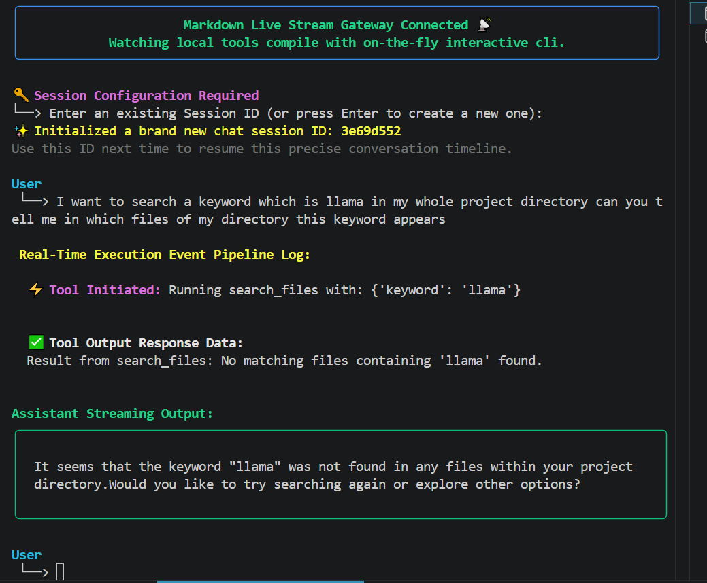

# Local AI Developer & System Assistant

An offline AI assistant powered by a local LLM that can inspect projects, analyze code, diagnose system issues, interact with files, maintain conversation history, stream responses in real time, and provide full observability through LangSmith.

---

## Overview

Most AI applications today depend on cloud-hosted language models. While cloud systems are powerful, they are not always suitable for real-world environments.

Organizations often face:

* Privacy and compliance requirements
* Sensitive internal source code
* Restricted network environments
* High API costs at scale
* Latency introduced by network round trips
* Edge deployments with unreliable internet connectivity

This project demonstrates how to build a fully local AI assistant that runs entirely offline using a small language model while still providing many of the capabilities commonly found in production AI systems.

The assistant uses a locally running LLM through Ollama and combines it with tool calling, conversation memory, streaming responses, observability, and system inspection capabilities.

---

## Why Offline AI Assistants Matter

### Privacy

Source code, internal documents, logs, and system information never leave the local machine.

### Reduced Operational Cost

No token billing from cloud providers.

Running costs are limited to local hardware resources.

### Edge Deployments

Many environments do not have guaranteed internet access:

* Manufacturing plants
* Oil rigs
* Military systems
* Healthcare facilities
* Remote field operations
* Air-gapped enterprise environments

Local AI assistants continue functioning even when internet access is unavailable.

### Lower Network Latency

Requests do not need to travel to remote servers.

All inference occurs locally.

---

## Architecture

User Request

↓

FastAPI Server

↓

LangChain Agent

↓

Tool Selection

↓

System Tools / File Tools / Code Tools

↓

Local LLM (Ollama + Llama 3.2)

↓

Streaming Response

↓

SQLite Memory Storage

↓

LangSmith Observability

---

### CLI Interface

Image:



Shows:

* Interactive assistant usage
* Tool calling
* Final responses

---

## Core Features

### Local LLM Inference

* Ollama
* Llama 3.2 3B
* Fully offline execution
* No external model APIs

### Agentic Tool Calling

The assistant dynamically chooses tools based on user intent.

Examples:

* Find largest files
* Analyze code structure
* Search project files
* Detect TODOs and FIXMEs
* Generate test targets
* Inspect CPU usage
* Inspect memory usage
* Inspect disk usage
* List running processes

---

## Code Intelligence Tools

### Read File

Reads raw source code for deeper analysis.

### Project Tree

Generates repository structure.

### Search Files

Locates files across a project.

### Search Code

Searches for patterns inside source code.

### Analyze File

Provides:

* Imports
* Classes
* Functions
* Line counts

without loading the full file.

### Find TODOs

Detects:

* TODO
* FIXME
* BUG
* HACK

annotations.

### Find Possible Bugs

Flags:

* Empty exception handlers
* Mutable default arguments
* Common structural issues

### Generate Tests

Identifies testable functions and components.

---

## System Administration Tools

### CPU Monitoring

Current CPU utilization.

### Memory Monitoring

RAM usage statistics.

### Disk Monitoring

Storage utilization information.

### Running Processes

Process inspection.

### Largest Files

Disk consumption analysis.

---

## Shell Utilities

The assistant can safely execute predefined system operations through dedicated tools.

Examples:

* Current working directory
* Current user
* File management operations
* Safe system actions

---

## FastAPI Backend

The assistant is exposed through a FastAPI service.

### Standard Chat Endpoint

```http
POST /chat
```

Returns:

* Tool execution history
* Intermediate reasoning
* Final answer
* Session identifier

### Streaming Endpoint

```http
POST /chat/stream
```

Streams:

* Tool execution events
* Tool outputs
* Token-by-token generation

in real time.

---

## Streaming Responses

Instead of waiting for the entire answer to finish, tokens are streamed as they are generated.

Benefits:

* Faster perceived responsiveness
* Better user experience
* Visibility into agent execution

---

## Conversation Memory

Conversation history is stored using SQLite.

Each conversation receives a unique session identifier.

Benefits:

* Context-aware conversations
* Multi-turn interactions
* Persistent memory across requests

---

## LangSmith Observability

The project includes full LangSmith tracing and monitoring.

For every request, LangSmith records:

* User input
* Tool calls
* Tool inputs
* Tool outputs
* Agent reasoning chain
* LLM responses
* Token usage
* Latency metrics
* Session metadata

---

### LangSmith Trace View

Image:

```text
assets/screenshots/langsmith-trace.png
```

Shows:

* Agent execution
* Tool calls
* LLM responses
* Request timeline

---

## Performance Monitoring

LangSmith automatically tracks:

### Request Latency

* P50 latency
* P95 latency
* P99 latency

### Token Usage

* Input tokens
* Output tokens
* Total tokens

### Tool Performance

* Tool execution times
* Tool frequency
* Tool failures

### Error Monitoring

* Failed requests
* Agent exceptions
* Tool exceptions

---

## Understanding Local Model Latency

One of the most important observations from this project is that local inference latency is often misunderstood.

Users frequently assume the model itself is slow.

In reality, most latency comes before generation begins.

Typical request lifecycle:

1. Load model weights into RAM
2. Prepare context window
3. Inject conversation history
4. Inject tool outputs
5. Build final prompt
6. Compute first token
7. Generate response tokens

The first token is typically the most expensive step.

In this project:

* Generation often takes only a few seconds
* Most latency comes from model preparation and prompt processing
* Running entirely on CPU increases response times significantly

With dedicated GPUs, latency can be reduced dramatically.

---

## Project Structure

```text
src/
├── agent/
├── api/
├── db/
├── tools/
│   ├── code_tools.py
│   ├── system_tools.py
│   └── shell_tools.py
├── models/
└── prompts/

assets/
└── screenshots/

data/
tests/
```

---

## Running the Project

Create environment:

```bash
uv venv
```

Install dependencies:

```bash
uv sync
```

Start Ollama:

```bash
ollama serve
```

Pull model:

```bash
ollama pull llama3.2
```

Run API server:

```bash
uvicorn src.api.server:app --reload
```

---

## Key Takeaways

This project demonstrates how modern AI systems can be built entirely offline while still supporting:

* Agentic workflows
* Tool calling
* Code intelligence
* System diagnostics
* Conversation memory
* Streaming responses
* Production observability
* Latency monitoring
* Token monitoring

The result is a practical local AI assistant capable of operating in privacy-sensitive, cost-sensitive, and network-constrained environments.
